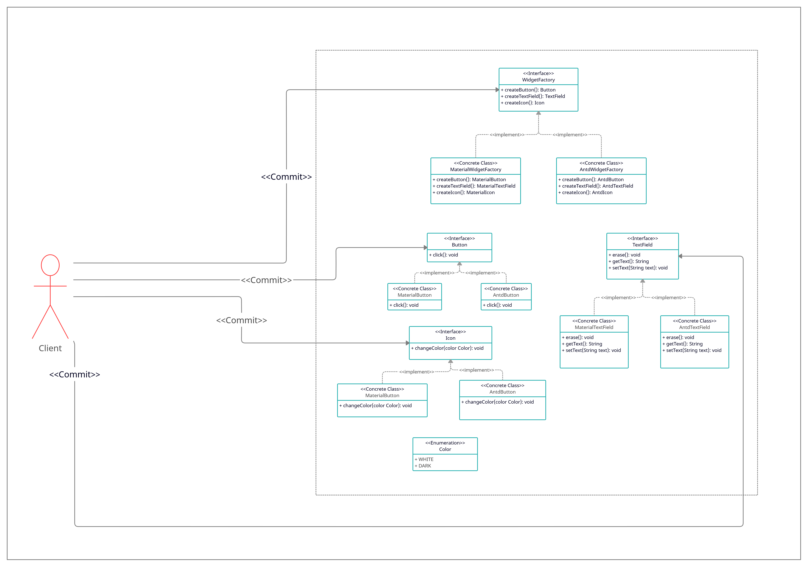

# Abstract Factory

## intent

Provide an interface for creating families of related or dependent objects without specifying their concrete classes.

## Applicability

Use the Abstract Factory pattern when:

- a system should be independent of how its products are created, composed, and represented.
- a system should be configured with one of multiple families of products.
- a family of related product objects is designed to be used together, and you need to enforce this constraint.
- you want to provide a class library of products, and you want to reveal just their interface, not their implementations.

## Example Usecase

### Problem Statement

Consider a graphical system where a client wants to use a set of widgets to create a GUI. Taking into consideration the flexibility of the system, the client should be able to change to any graphical design systems, such as [Material](https://material.io/design) or [Antd](https://ant.design/), at any time with minimal code change.

To achieve such modularity, we will use the **Abstract Factory** pattern to provide the client with a set of interfaces to describe how to instantiate such widgets from a specific graphical design systems without committing to a specific implementation. The implementation of such interface should be provided at runtime.

### Class Diagram

### Participants

- AbstractFactory (WidgetFactory)
  - declares an interface for operations that create abstract product objects.
- ConcreteFactory (MaterialWidgetFactory, AntdWidgetFactory)
  - implements the operations to create concrete product objects.
- AbstractProduct (Button, TextField, Icon)
  - declares an interface for a type of product object.
- ConcreteProduct (MaterialButton, MaterialTextField, MaterialIcon, AntdButton, AntdTextField, AntdIcon)
  - defines a product object to be created by the corresponding concrete factory.
  - implements the AbstractProduct interface.
- Client
  - commits only to the interfaces declared by AbstractFactory and AbstractProduct classes.
