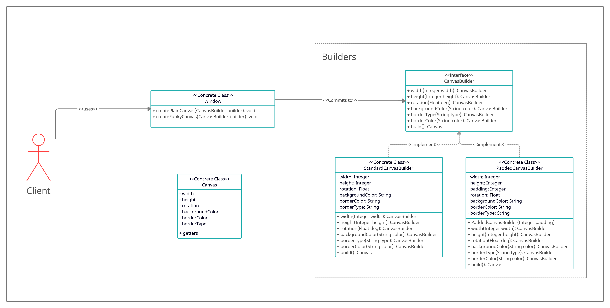

# Builder

## intent

Separate the construction of a complex object from its representation so that the same construction process can create different representations.

## Applicability

Use the Builder pattern when:

- the algorithm for creating a complex object should be independent of the parts that make up the object and how they're assembled.
- the construction process must allow different representations for the object that's constructed.

## Example Usecase

### Problem Statement

Consider a graphical system where a client is required to create a `Canvas` where anyone is allowed to draw on. There will be a `Window` object that encapsulates the `Canvas` and provides a set of canvas templates where the client chooses from. The `Window` object should be able to construct different canvas's and the constructed canvas must be **immutable**.

To be able to provide the `Window` object with the flexibility of creating any complex looking canvas's, we will use the builder pattern to make a `CanvasBuilder` that will facilitate the construction of a `Canvas` immutable object.

### Class Diagram

### Participants

- Builder (CanvasBuilder)
  - specifies an abstract interface for creating parts of a Product object.
- ConcreteBuilder (StandardCanvasBuilder, PaddedCanvasBuilder)
  - constructs and assembles parts of the product by implementing the Builder interface.
  - defines and keeps track of the representation it creates.
  - provides an interface for retrieving the product.
- Director (Window)
  - constructs an object using the Builder interface.
- Product (Canvas)
  - represents the complex object under construction. ConcreteBuilder builds the product's internal representation and defines the process by which it's assembled.
  - includes classes that define the constituent parts, including interfaces for assembling the parts into the final result.
