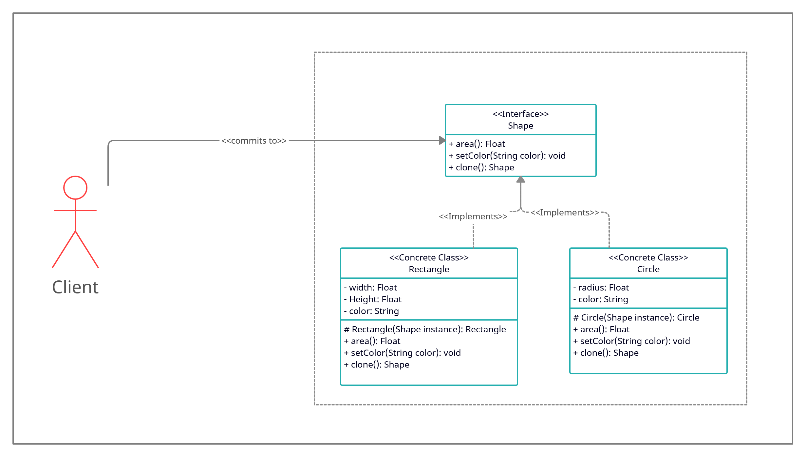

# Prototype

## intent

Specify the kinds of objects to create using a prototypical instance, and create new objects by copying this prototype.

## Applicability

Use the Prototype pattern when a system should be independent of how its products are created, composed, and represented; and:

- when the classes to instantiate are specified at run-time, for example, by dynamic loading.
- to avoid building a class hierarchy of factories that parallels the class hierarchy of products.
- when instances of a class can have one of only a few different combinations of state. It may be more convenient to install a corresponding number of prototypes and clone them rather than instantiating the class manually, each time with the appropriate state.

## Example Usecase

### Problem Statement

Consider that we're building a graphical tool that enables the user to draw circles and rectangles on a given canvas. The tool should provide a way for the user to create new shapes, as well as copy the existing shapes into new ones. How would we approach this problem without hardly coupling the shapes implementation into the canvas?

Using the Prototype pattern, we can delegate the cloning logic to the shape object itself at runtime. This will hide the shape implementations from the canvas (Client) and will facilitate the copying operations.

### Class Diagram

### Participants

- Prototype (Shape)
  - declares an interface for cloning itself.
- ConcretePrototype (Circle, Rectangle)
  - implements an operation for cloning itself.
- Client (Canvas)
  - creates a new object by asking a prototype to clone itself.
