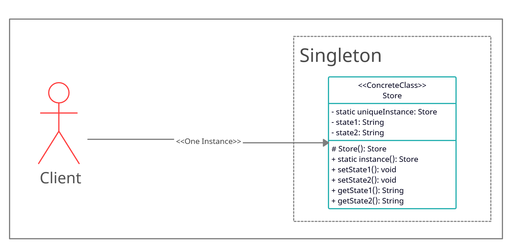

# Singleton

## intent

Ensure a class only has one instance, and provide a global point of access to it.

## Applicability

Use the Singleton pattern when:

- there must be exactly one instance of a class, and it must be accessible to clients from a well-known access point.
- when the sole instance should be extensible by subclassing, and clients should be able to use an extended instance without modifying their code.

## Example Usecase

### Problem Statement

Consider that we want to build a website using [React](https://reactjs.org/). The website that we want to build contains alot of states, and each state should be visible to the whole application at all times so that it can render the views accordingly. How would we do such thing without global variables?

We can create a class called `Store` that is responsible for holding the state of the application at any given time. Using the Singleton pattern, we can ensure that only one instance of the `Store` is being used by the entire application. Any change in state should reflect on the whole app.

### Class Diagram

### Participants

- Singleton (`Store`)
  - defines an Instance operation that lets clients access its unique instance. instance is a class operation.
  - maybe responsible for creating its own unique instance.
