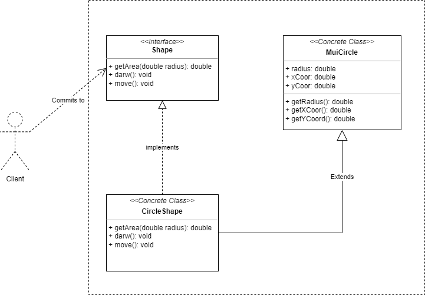

# Adapter

## intent

Convert the interface of a class into another interface clients expect. Adapter lets classes work together that couldn't otherwise because of incompatible interfaces.

## Applicability

Use the Adapter pattern when:

- you want to use an existing class, and its interface does not match the one you need.
- you want to create a reusable class that cooperates with unrelated or unforeseen classes, that is, classes that don't necessarily have compatible interfaces.
- (object adapter only) you need to use several existing subclasses, but it's unpractical to adapt their interface by subclassing every one. An object adapter can adapt the interface of its parent class.

## Example Usecase

### Problem Statement

Consider a graphical drawing system that requires a set of features to enable shape drawing on a given canvas. You start by defining a generic Shape interface for all of your desired shapes to implement. Midway implementation, you realize that it's time consuming to implement some of the functionalities from scratch. You found out that there's a library called **MUI** that provides an implementation for the shape you want. The problem is, MUI does not conform to the `Shape` interface taht you already defined.

To solve this issue, we may consider using the Adapter pattern in one of its two forms:

- **class pattern**: Create a new concrete class that implements the `Shape` interface and extends the `MUI` concrete class. That way, you can use the MUI functionality to serve the implementation of the `Shape` interface.
- **object pattern:** Create a new concrete class that implements the `Shape` interface and let that class instaniate an instance from the `MUI` class at runtime. That way, you can use its functionality at runtime without having to extend the class.

for the sake of simplicity, we'll use the class pattern in our example.

### Class Diagram

### Participants

- Target (Shape)
  - defines the domain-specific interface that Client uses.
- Client
  - collaborates with objects conforming to the Target interface.
- Adaptee (MuiCircle)
  - defines an existing interface that needs adapting.
- Adapter (CircleShape)
  - adapts the interface of Adaptee to the Target interface.
