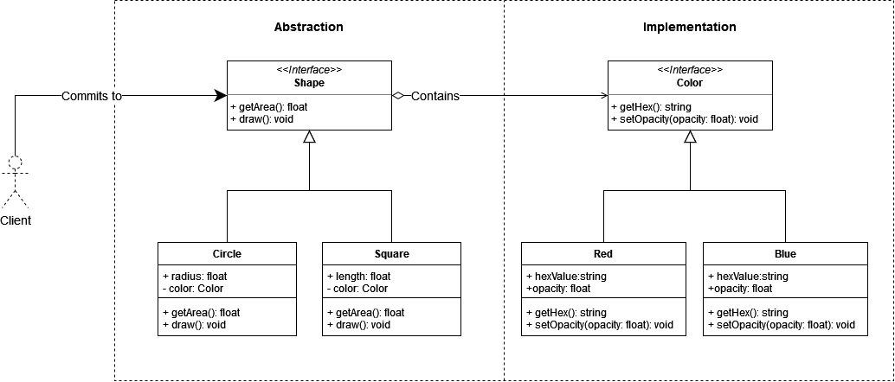

# Bridge

## intent

Decouple an abstraction from its implementation so that the two can vary independently.

## Applicability

Use the Bridge pattern when:

- you want to avoid a permanent binding between an abstraction and its implementation. This might be the case, for example,when the implementation must be selected or switched at run-time.
- both the abstractions and their implementations should be extensible by subclassing. In this case, the Bridge pattern lets you combine the different abstractions and implementations and extend them independently.
- changes in the implementation of an abstraction should have no impact on clients; that is, their code should not have to be recompiled.
- (C+ +) you want to hide the implementation of anabstraction completely from clients. In C++ the representation of a class is visible in the class interface.
- you want to share an implementation among multiple objects (perhaps using reference counting), and this fact should be hidden from the client.

## Example Usecase

### Problem Statement

Suppose that we want to implement a Shapes library that contains a wide range of shapes with different properties. We decide that we'll define a `Shape` interface that will outline the generic behaviour of all shapes. We then implement the `Shape` interface into two concrete Classes: `Circle` and `Square`. Later on, we decide that we want to implement shapes with different colors: `Red` and `Blue`. Trivially, We proceed to implement two concrete classes for each shape to cover all of the possible color combinations respectively: `RedCircle`, `BlueCircle`, `RedSquare` and `BlueSquare`. This may seem fine at first, but imagine we want to implement **20** different colors for each shape implementation. In that case, we'll have to define a concrete class for each color and shape combination, which is tedious and can complicate your codebase.

To patch that, we'll decouple the `Color` property from the `Shape` interface and encapsulate it in its own interface/abstract class, and provide the `Color` object to the `Shape` implementation at runtime. That way, we implement any number of `Color` classes without worrying about changing the implementation of the `Shape` concrete classes.

### Class Diagram

### Participants

- Abstraction (Shape)
  - defines the abstraction's interface.
  - maintains a reference to an object of type Implementor.
- RefinedAbstraction (Circle, Square)
  - Extends the interface defined by Abstraction.
- Implementor (Color)
  - defines the interface for implementation classes. This interface doesn't have to correspond exactly to Abstraction's interface; in fact the two interfaces can be quite different. Typically the Implementor interface provides only primitive operations, and Abstraction defines higher-level operations based on these primitives.
- Concretelmplementor (Red, Blue)
  - implements the Implementor interface and defines its concrete implementation.
