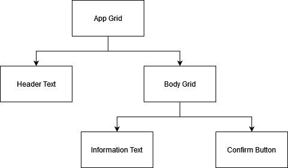
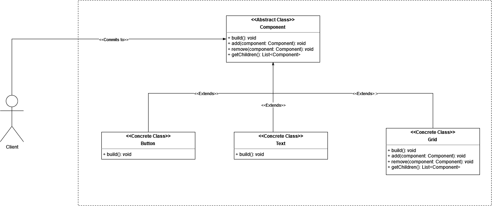

# Composite

## intent

Compose objects into tree structures to represent part-whole hierarchies. Composite lets clients treat individual objects and compositions of objects uniformly.

## Applicability

Use the Composite pattern when:

- you want to represent part-whole hierarchies of objects.
- you want clients to be able to ignore the difference between compositions of objects and individual objects. Clients will treat all objects in the composite structure uniformly.

## Example Usecase

### Problem Statement

Suppose that we want to build the following simple UI (in the same tree-like structure):

  

one way to do that is to define each UI component individually, and then write a recursive function to render all of the components respectively. This solution introduces three main problems:

- recursive implementation may be complex to implement.
- the client should be aware of the UI rendering logic to be able to implement a recursive rendering logic.
- the client will have to treat premitive components (i.e. Text and Button) and composite components (i.e. Grid) in a seperate manner.

To fix these issues, Composite pattern comes into play. We would define a base interface that will govern both premitive (i.e. Text and Button) and composite (i.e. Grid) components. This will enable the delegation of the rendering logic from the composite component to its premitive children. It will also enable the client to treat premitives and composites equally without worrying about the residing logic.

### Class Diagram

### Participants

- Component (Component)
  - declares the interface for objects in the composition.
  - implements default behavior for the interface common to all classes, as appropriate.
  - (optional) defines an interface for accessing a component's parent in the recursive structure, and implements it if that's appropriate.
- Leaf (Text, Button)
  - represents leaf objects in the composition. A leaf has no children.
  - defines behavior for primitive objects in the composition.
- Composite (Grid)
  - defines behavior for components having children.
  - stores child components.
  - implements child-related operations in the Component interface.
- Client
  - manipulates objects in the composition through the Component interface.
