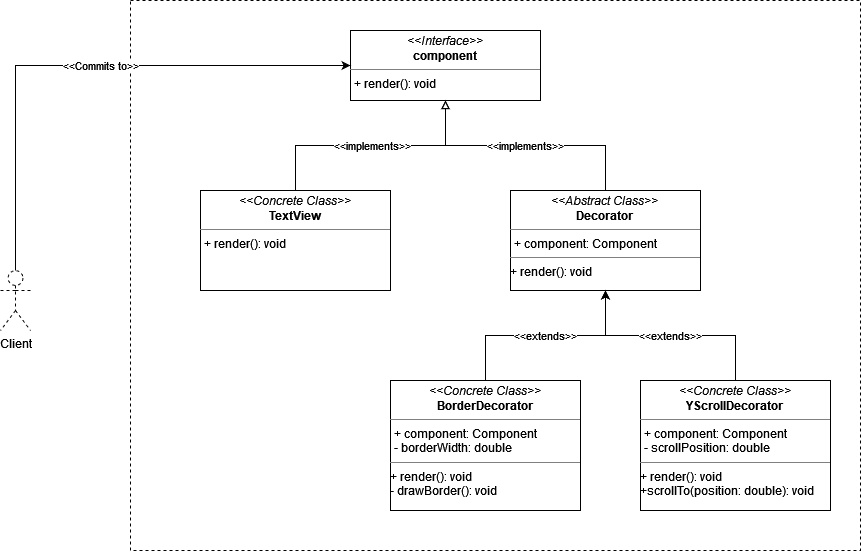

# Decorator

## intent

Attach additional responsibilities to an object dynamically. Decorators provide a flexible alternative to subclassing for extending functionality.

## Applicability

Use Decorator pattern when:

- to add responsibilities to individual objects dynamically and transparently, that is, without affecting other objects.
- for responsibilities that can be withdrawn.
- when extension by subclassing is impractical. Sometimes a large number of independent extensions are possible and would produce an explosion of subclasses to support every combination. Or a class definition maybe hidden or otherwise unavailable for subclassing.

## Example Usecase

### Problem Statement

Suppose we have a UI framework that has a fundemental `Component` interface which all of the GUI elements implement functionality from. Suppose we have a premitive component called `TextView` that directly implements the `Component` interface, and we want to add the following functionalities/responsibilities to the `TextView`:

- A border with a specific width.
- A vertical scrolling functionality.

One solution for this issue is to subclass the `TextView` into `BorderedTextView`, `ScrollableTextView` and `BorderedScrollableTextView` subclasses. However, what if we want to add more responsibilities to the `TextView`? an infinite combination of subclassing may arise. To solve this issue, we'll introduce the `Decorator` abstract class that will implement the `Component` interface, and will act as a base class for extending responsibilities on top of the premitive components. In our example, we'll have `BorderDecorator` and `ScrollDecorator` decorators that will take the premitive component `TextView` and extend its implementation with the needed functionalities.

### Class Diagram

### Participants

- Component (Component)

  - defines the interface for objects that can have responsibilities added to them dynamically.

- ConcreteComponent (TextView)

  - defines an object to which additional responsibilities can be attached.

- Decorator

  - maintains a reference to a Component object and defines an interface that conforms to Component's interface.

- ConcreteDecorator (BorderDecorator, YScrollDecorator)
  - adds responsibilities to the component.
