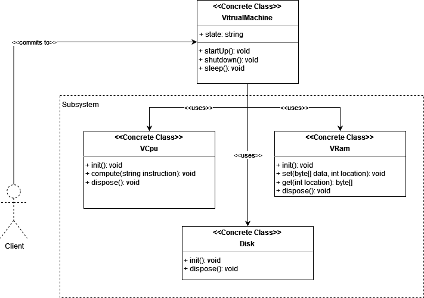

# Facade

## intent

Provide a unified interface to a set of interfaces in a subsystem. Facade defines a higher-level interface that makes the subsystem easier to use.

## Applicability

Use Facade pattern when:

- you want to provide a simple interface to a complex subsystem. Subsystems often get more complex as they evolve.
- there are many dependencies between clients and the implementation classes of an abstraction. Introduce a facade to decouple the subsystem from clients and other subsystems, thereby promoting subsystem independence and portability.
- you want to layer your subsystems. Use a facade to define an entry point to each subsystem level. If subsystems are dependent, then you can simplify the dependencies between them by making them communicate with each other solely through their facades.

## Example Usecase

### Problem Statement

Assume a system where we want to create a virtual machine. For the sake of simplicity, the VM will only consist of:

- CPU
- RAM
- Disk

A client wants to effectively create a virtual machine from these components. However, the client does not know how to interact with these individual components of the system to create a virutal machine. To solve this issue, a facade `VirtualMahcine` class is created to serve as an API to interact build and interact with the virtual machine. This class will hide the implementation of the subsystem components and provide a point of interaction for the client to easily use the system.

### Class Diagram

### Participants

- Facade (VirtualMachine)
  - knows which subsystem classes are responsible for a request.
  - delegates client requests to appropriate subsystem objects.
- subsystem classes (VCpu, VRam, Disk, etc.)
  - implement subsystem functionality.
  - handle work assigned by the Facade object.
  - have no knowledge of the facade; that is, they keep no references to it.
